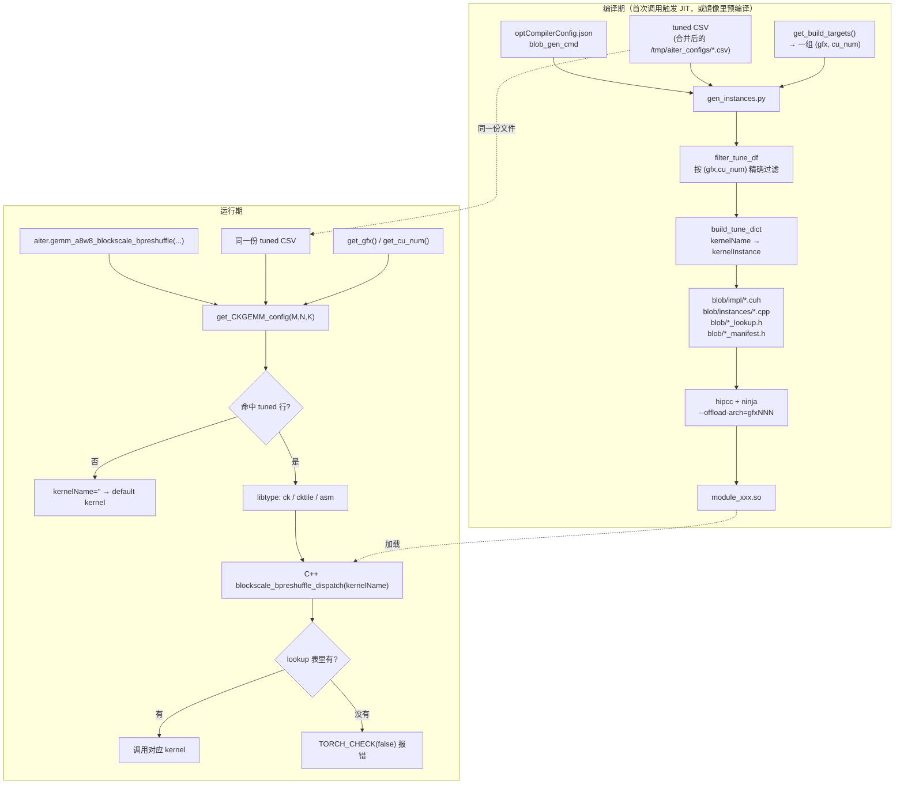

# aiter CK GEMM 的 JIT 编译、查找表与架构对应关系

> 本文以 `gemm_a8w8_blockscale_bpreshuffle` 为例，梳理 aiter 里 CK GEMM 算子从「编译期生成 kernel 实例」到「运行期按 shape 选 kernel」的完整链路，重点讲清楚 **gfx / cu_num 这两个维度在编译期和运行期分别是怎么取值、怎么对齐的**，以及不对齐时会出现什么故障。
>
> 其余 CK GEMM 模块（`gemm_a8w8`、`gemm_a8w8_blockscale`、`gemm_a8w8_bpreshuffle`、`gemm_a4w4_blockscale`、batched 系列……）结构完全一致，只是 CSV 名字、模块名和 kernel 命名前缀不同。

---

## 1. 一句话概括

aiter 的 CK GEMM **不会把所有 kernel 都编进 `.so`**，而是在编译时读一份 tuned CSV，只为 CSV 里出现过的 `(gfx, cu_num, M, N, K)` 组合生成 kernel 实例；运行时再用同样的键去查同一份 CSV，拿到 `kernelName` 字符串，交给 C++ 侧在编译进去的注册表里查函数指针。

**两侧用的键必须一致**。一旦编译期看到的 `(gfx, cu_num)` 和运行期算出来的不一样，或者 CSV 在编译之后被更新过，运行期就会查到一个没编进 `.so` 的 kernel 名，报：

```
RuntimeError: gemm_a8w8_blockscale_bpreshuffle kernel '<name>' is not present in
the compiled registry. The tuned CSV references a kernel that was not built into
aiter. Rebuild aiter (or remove this row from ...) and try again.
```

---

## 2. 全景图



---

## 3. 三张「表」，别搞混

| 表 | 存在形式 | 键 | 值 | 谁产生 | 谁消费 |
|---|---|---|---|---|---|
| **① tuned CSV** | 磁盘 csv 文件 | `(gfx, cu_num, M, N, K)` | `libtype` + `kernelName` + `splitK` | tuner 跑出来的结果，人工提交进 repo | 编译期 `gen_instances.py`、运行期 `get_CKGEMM_config` |
| **② kernel 池** | Python 字典 `kernels_list` / `kernels_by_name` | `kernelId` 整数 / `kernelName` 字符串 | `kernelInstance`（一堆 CK 模板参数） | `*_common.py` 里硬编码 | 只在编译期用 |
| **③ C++ lookup 表** | 生成的 `*_lookup.h` 宏 | `kernelName` 字符串 | 函数指针 | 编译期 `write_name_keyed_lookup_header` | 只在运行期用 |

关键点：

- 表 ② 是**全量池**（本模块 18 个 kernel），表 ③ 是**池的子集**（只有 CSV 点名要的那些）。
- 表 ① 是编译期和运行期**唯一的交汇点**，它是「合约」。合约变了而 `.so` 没重编，就会出事。
- 表 ③ 的键是**字符串**（自 PR #3075 起改成 name-keyed dispatch），不是 `(M,N,K)` 元组。也就是说 shape → kernel 的映射决策完全在 Python 侧完成，C++ 只负责「按名字取函数指针」。

CSV 的列长这样（`aiter/configs/a8w8_blockscale_bpreshuffle_tuned_gemm.csv`）：

```
gfx,cu_num,M,N,K,libtype,kernelId,splitK,us,kernelName,tflops,bw,errRatio
gfx950,256,2048,512,7168,ck,17,3,21.5224,a8w8_blockscale_bpreshuffle_1x128x128_256x64x64x256_...,698.45,950.04,0.0
gfx942,80,16,7168,7168,ck,6,2,23.7442,a8w8_blockscale_bpreshuffle_1x128x128_256x16x128x256_...,69.25,2178.4,0.0
```

`kernelName` 本身就是 CK 模板参数的编码，例如
`a8w8_blockscale_bpreshuffle_1x128x128_256x16x128x256_16x16_16x16_16x16x1_16x16x1_1x16x1x16_8_1x2_intrawave_v1`
依次是 `ScaleBlockM x ScaleBlockN x ScaleBlockK` / `BLOCK_SIZE x MPerBLOCK x NPerBLOCK x KPerBLOCK` / `MPerXDL x NPerXDL` / `WAVE_MAP_M x WAVE_MAP_N` / `ABLOCK_TRANSFER` / `BBLOCK_TRANSFER` / `CBLOCK_TRANSFER` / `CBLOCK_SPV` / `CShuffle` / `PIPELINE_Sched + VERSION`。

---

## 4. 编译期链路

### 4.1 什么时候触发编译

算子函数上挂着 `@compile_ops("module_gemm_a8w8_blockscale_bpreshuffle")`（`aiter/jit/core.py`）。调用时：

1. `get_module(md_name)` 尝试 import `.so`；
2. import 失败（`ModuleNotFoundError`）→ 走 `get_args_of_build()` + `build_module()` 现场编译。

`.so` 的查找目录由 `get_user_jit_dir()` 决定（`aiter/jit/core.py:431`）：

- 设了 `AITER_JIT_DIR` → 用它；
- 否则若 `aiter/jit/` 可写 → 用 `aiter/jit/`（源码树内，pip -e 安装的典型情况）；
- 否则 → `~/.aiter/jit/`。

中间产物在 `{jit_dir}/build/{md_name}/`。

> 镜像里常见做法是构建时用 `setup.py` + `PREBUILD_KERNELS=1` 把一批 `.so` 提前编好放进 `aiter/jit/`。这时运行期就**不会**再触发 JIT，直接加载预编译产物 —— 这正是后面第 7 节故障的前提。

### 4.2 `_needs_arch_rebuild`：只看 gfx，不看 cu_num

`aiter/jit/core.py:629`：

```python
def _needs_arch_rebuild(md_name):
    cur = get_gfx_runtime()                    # rocminfo 探测真实 GPU
    built = _so_offload_archs(so_path)         # 从 .so 的 offload bundle 解析 amdhsa--gfxNNN
    if not built or cur in built:
        return False
    ...  # 只有 gfx 完全不匹配才强制重编
```

**这是个重要的认知点**：这个保护只覆盖「拿 gfx950 的 `.so` 跑在 gfx942 上」这种情况。同为 gfx942 的 MI300X 和 MI308X，`.so` 里的 offload arch 都是 `gfx942`，它检查不出差异，所以 **cu_num 错配不会触发自动重建**。

### 4.3 blob_gen_cmd → gen_instances.py

模块定义在 `aiter/jit/optCompilerConfig.json:220`：

```json
"module_gemm_a8w8_blockscale_bpreshuffle": {
    "srcs": [...],
    "blob_gen_cmd": "f'{AITER_CSRC_DIR}/ck_gemm_a8w8_blockscale_bpreshuffle/gen_instances.py --working_path {{}} --tune_file {AITER_CONFIGS.AITER_CONFIG_GEMM_A8W8_BLOCKSCALE_BPRESHUFFLE_FILE}'"
}
```

注意 `--tune_file` 用的是 `AITER_CONFIGS.AITER_CONFIG_..._FILE` 这个 **property**，也就是说编译期拿到的是**合并后**的 CSV 路径（见 5.1），跟运行期完全同源。`build_module` 里 `exec_blob()` 直接 `os.system` 执行它，把产物写进 `{op_dir}/blob/`，然后把 blob 目录下所有源文件加入编译列表。

### 4.4 过滤：`get_tune_dict` → `build_tune_dict` → `filter_tune_df`

`csrc/ck_gemm_a8w8_blockscale_bpreshuffle/gen_instances.py:277`：

```python
def get_tune_dict(tune_dict_csv):
    if os.path.exists(tune_dict_csv):
        return build_tune_dict(
            pd.read_csv(tune_dict_csv),
            default_kernels_dict,      # {-1: 默认 kernel}
            kernels_list,              # 18 个 kernel 的全量池
            libtype="ck",              # 只要 ck 行，asm/cktile 归别的模块
            kernels_by_name=kernels_by_name,
        )
    return default_kernels_dict
```

`build_tune_dict`（`aiter/jit/utils/chip_info.py:202`）做三件事：

1. `targets = get_build_targets()` —— 决定这次编译服务于哪些 `(gfx, cu_num)`；
2. `filter_tune_df(tune_df, targets)` —— **精确相等**匹配，`(df.gfx == gfx) & (df.cu_num == cu_num)`，没有任何模糊/就近匹配；
3. 逐行把 `kernelName` 映射到 `kernelInstance`；**任何一行的 kernelName 不在池里就直接 `raise RuntimeError`**，宁可构建失败也不产出一个注定运行期报错的 `.so`。

第 3 点很关键：它保护的是「CSV 引用了源码里不存在的 kernel」，**但保护不了「CSV 一行都没匹配上」** —— 那种情况下过滤结果为空集，构建正常通过，只是 lookup 表是空的。

### 4.5 产物长什么样

`gen_instances()` 在 `blob/` 下生成四类文件：

| 文件 | 内容 | 数量 |
|---|---|---|
| `impl/<kernelName>.cuh` | CK 模板实例化的函数体（含 pad / no-pad 两个分支） | 每个 kernel 1 个 |
| `instances/<kernelName>_dFP32_eBF16.cpp`<br/>`instances/<kernelName>_dFP32_eFP16.cpp` | 显式模板实例化，各自是一个编译单元 | 每个 kernel 2 个 |
| `*_lookup.h` | `GENERATE_LOOKUP_TABLE(DTYPE, ETYPE)` 宏，展开成 `{{"name", name<DTYPE,ETYPE>}, ...}` | 1 个 |
| `*_manifest.h` | 所有 kernel 的前向声明 | 1 个 |

健康的 lookup 表长这样：

```c
#define GENERATE_LOOKUP_TABLE(DTYPE, ETYPE)                        \
   {                                                               \
       {"a8w8_blockscale_bpreshuffle_1x128x128_256x16x128x256_...", \
        a8w8_blockscale_bpreshuffle_1x128x128_256x16x128x256_...<DTYPE, ETYPE>},  \
       ...
   }
```

**空表（故障特征）长这样**：

```c
#define GENERATE_LOOKUP_TABLE(DTYPE, ETYPE)                        \
   {                                                               \
   }
```

注意 `default_kernels_dict` 的负数键（`-1`）在 name-keyed 表里会被跳过 —— 默认 kernel 由 `.cu` 直接按符号引用，不走表。所以**即使 lookup 表全空，`.so` 依然能正常加载、default 路径依然能跑**，只有命中 tuned 行时才炸。这也是这类故障往往「跑一半才崩」的原因。

### 4.6 `--offload-arch` 和 tuned 过滤是两回事

`build_module` 里：

```python
archs = validate_and_update_archs()           # 读 GPU_ARCHS，native → 实际 gfx
flags_hip += [f"--offload-arch={arch}" for arch in archs]
```

这决定 `.so` 里带哪些 GPU 的**机器码**；而 `filter_tune_df` 决定编进去**哪些 kernel**。二者用的都是 `GPU_ARCHS`，但前者只关心 gfx，后者还关心 cu_num。**`--offload-arch` 对了不代表 kernel 集合对了**。

### 4.7 tune 模块是另一回事

`module_gemm_a8w8_blockscale_bpreshuffle_tune` 的 `blob_gen_cmd` 带 `--tune` 参数，此时 `codegen.gen_instances(kernels_list)` 直接把**全量 18 个 kernel** 都编出来，lookup 表用 `kernelId` 整数键。tuner 就是靠它把每个 kernel 都跑一遍再挑最优，写回 CSV。所以 tune 模块编译很慢、体积很大，推理模块则很小。

---

## 5. 运行期链路

### 5.1 CSV 从哪来：`model_configs/` 自动合并

`aiter/jit/core.py:345` 的 `get_config_file()`：

```python
if not config_env_file:                                   # 没设 AITER_CONFIG_* 环境变量
    op_tuned_file_list = model_config_dir.glob(f"*{tuned_file_name}*.csv")
    if not op_tuned_file_list:
        config_file = default_file                        # 只用 configs/ 下的基础 CSV
    else:
        tuned_files = default_file + ":" + ":".join(...)  # 基础 CSV + 所有 model_configs
        config_file = self.update_config_files(tuned_files, tuned_file_name)
else:
    config_file = self.update_config_files(config_env_file, tuned_file_name)
```

`update_config_files` 用 pandas 把多份 CSV 拼起来去重，写到 `/tmp/aiter_configs/<name>.csv`，返回这个临时路径。日志里会打印：

```
[aiter] merge tuned file under model_configs/ and configs/ /sgl-workspace/aiter/aiter/configs/a8w8_blockscale_bpreshuffle_tuned_gemm.csv:.../model_configs/dsv4_...csv:.../model_configs/..._dsv3.csv:...
```

**推论 1**：`configs/` 下的基础 CSV 只是合并源之一，实际生效的往往是 `/tmp/aiter_configs/` 里那份大得多的合并结果。排查时一定要看合并后的文件。

**推论 2**：glob 是按**算子名**匹配的，不区分模型。跑 DSv4 时，`a8w8_blockscale_bpreshuffle_tuned_gemm_dsv3.csv`、`glm5_*.csv`、`qwen3*.csv` 全都会被合进来。只要 shape 撞上了，就会用别的模型 tune 出来的行。

**推论 3**：设了 `AITER_CONFIG_GEMM_A8W8_BLOCKSCALE_BPRESHUFFLE=<单个路径>` 就会**跳过 model_configs 的 glob**，这是最简单的临时绕过手段。

### 5.2 查表：`get_CKGEMM_config`

`aiter/ops/gemm_op_a8w8.py:404`：

```python
gfx = get_gfx()            # 注意：GPU_ARCHS-aware，不是 get_gfx_runtime()
cu_num = get_cu_num()      # 注意：CU_NUM 环境变量优先，否则 rocminfo
for gl in [None, 0, 1]:
    padded_M = M if gl is None else get_padded_m(M, N, K, gl)
    key = (gfx, cu_num, padded_M, N, K)
    config = cache.get(key)
    if config is not None:
        break
```

三次尝试：先用原始 M 精确查，查不到再用两档粒度把 M 向上对齐后重查。N、K 必须精确相等，没有任何近似。查不到就返回 `None`，打一条日志：

```
[aiter] shape is M:64, N:2048, K:7168, not found tuned config in /tmp/aiter_configs/..., will use default config!
```

### 5.3 分流与 C++ dispatch

`gemm_a8w8_blockscale_bpreshuffle`（`aiter/ops/gemm_op_a8w8.py:850`）按 `config["libtype"]` 把请求发给三个不同后端：

| libtype | 走向 | 说明 |
|---|---|---|
| `ck` | `gemm_a8w8_blockscale_bpreshuffle_ck` | 本文主角，CK 模板 kernel，走 name-keyed lookup |
| `cktile` | `gemm_a8w8_blockscale_bpreshuffle_cktile` | ck_tile 实现，独立模块独立 lookup |
| `asm` | `gemm_a8w8_blockscale_bpreshuffle_asm` | 手写汇编，从 `hsa/gfxNNN/` 下加载 `.co`，不受本文的实例化机制影响 |
| `None`（没查到） | `..._ck(..., kernelName="")` | 空字符串 → C++ 走 default 分支 |

C++ 侧（`csrc/ck_gemm_a8w8_blockscale_bpreshuffle/gemm_a8w8_blockscale_bpreshuffle.cu:25`）：

```cpp
static const auto lookup = BlockwiseKernelMap{GENERATE_LOOKUP_TABLE(DDataType, B16)};

if (!kernelName.empty()) {
    auto it = lookup.find(std::string_view{kernelName});
    if (it != lookup.end()) return it->second;
    TORCH_CHECK(false, "... is not present in the compiled registry ...");
}
return a8w8_blockscale_bpreshuffle_1x128x128_256x64x64x128_..._intrawave_v1<DDataType, EDataType>;  // default
```

三条路径清清楚楚：**空名 → default；有名且在表里 → 用它；有名但不在表里 → 硬报错**。

---

## 6. 架构是如何对应的（核心）

一切都归结为两个标量：`gfx` 和 `cu_num`。它们在编译期和运行期各有一条取值路径。

### 6.1 取值来源

| 维度 | 编译期 | 运行期 |
|---|---|---|
| **gfx** | `get_build_targets()`：`GPU_ARCHS` 非空且非 "native" → 解析它；否则 `get_gfx()`（GPU_ARCHS-aware，回落 rocminfo） | `get_gfx()`（同样 GPU_ARCHS-aware） |
| **cu_num** | `GPU_ARCHS` 显式指定时 → `int(os.getenv("CU_NUM", GFX_CU_NUM_MAP[gfx]))`；否则 `get_cu_num()`（rocminfo 实测） | `get_cu_num()`：`CU_NUM` 环境变量优先，否则 rocminfo 实测 |

`get_build_targets()`（`aiter/jit/utils/chip_info.py:172`）：

```python
gpu_archs = os.getenv("GPU_ARCHS")
if gpu_archs and gpu_archs.lower() != "native":
    return get_build_targets_env()        # 纯 env 路径，可能用默认 CU 数
return [(get_gfx(), get_cu_num())]        # 有 GPU 的路径，实测
```

而默认 CU 数表（`aiter/jit/utils/build_targets.py:39`）：

```python
GFX_CU_NUM_MAP = {
    "gfx942": 304,  # MI300X (SPX, full GPU); MI308X shares gfx942 — use CU_NUM override
    "gfx950": 256,  # MI350
    "gfx1250": 256, # MI400 placeholder; set CU_NUM explicitly for the target SKU
}
```

### 6.2 常见 SKU 对照

| SKU | gfx | 满卡 CU | 备注 |
|---|---|---|---|
| MI300X | gfx942 | 304 | `GFX_CU_NUM_MAP` 的默认值就是它 |
| MI308X | gfx942 | **80** | **和 MI300X 同 gfx，CU 数完全不同 —— 最大的坑** |
| MI325X | gfx942 | 304 | |
| MI350 / MI355 | gfx950 | 256 | |

另外**分区模式**（SPX / DPX / QPX / CPX）会改变单个可见 device 的 CU 数。`get_cu_num()` 走 rocminfo 实测，所以能正确反映分区；而 `GFX_CU_NUM_MAP` 的默认值只对应 SPX 满卡。

### 6.3 四种典型环境组合

| 环境 | 编译期 target | 运行期 key | 对齐? |
|---|---|---|---|
| 有 GPU，`GPU_ARCHS` 未设 | `(实测 gfx, 实测 cu)` | `(实测 gfx, 实测 cu)` | ✅ 天然一致 |
| 有 GPU，`GPU_ARCHS=native` | 同上 | 同上 | ✅ |
| 无 GPU，`GPU_ARCHS=gfx942`，未设 `CU_NUM` | `("gfx942", 304)` | 部署到 MI308X 上是 `("gfx942", 80)` | ❌ **错配** |
| 无 GPU，`GPU_ARCHS=gfx942 CU_NUM=80` | `("gfx942", 80)` | `("gfx942", 80)` | ✅ |

**规则**：只要编译发生在「没有目标 GPU 的机器上」（CI、docker build），就必须同时显式给 `GPU_ARCHS` 和 `CU_NUM`。只给 `GPU_ARCHS` 时，binned SKU（MI308X）和非 SPX 分区一定会错。

### 6.4 错配的两种后果

错配不会立刻报错，而是分两种情况：

**情况 A：编译期 target 在 CSV 里有行，运行期 target 没有**
运行期查不到 tuned 行 → 全部走 default kernel → **能跑，但性能损失**，只在日志里留下 `will use default config!`。很隐蔽。

**情况 B：编译期 target 在 CSV 里没有行，运行期 target 有**
编译期过滤出空集 → lookup 表为空，只编了 default kernel → 运行期一旦命中 tuned 行就 `TORCH_CHECK(false)` **直接崩溃**。这就是第 7 节的故障。

### 6.5 还有一种不对齐：时间维度

即使 `(gfx, cu_num)` 完全对齐，**CSV 在 `.so` 编译之后被更新**（`git pull`、切分支、手工加行、新增 `model_configs/*.csv`）同样会造成情况 B。因为：

- `.so` 一旦存在，`get_module()` 就直接加载，**不会**校验 CSV 的内容或时间戳；
- `_needs_arch_rebuild()` 只比 gfx，不会因为 CSV 变了而重建。

**所以：改了任何 tuned CSV、或者更新了 aiter 源码树，都要手动重编受影响的模块。**

---

## 7. 故障复盘：DSv4 decode 起服务崩溃

### 现象

8 个 DP rank 在 Scheduler 初始化阶段全部挂掉，栈顶是 EAGLE draft（NextN）的 CUDA graph capture：

```
deepseek_v4_nextn.py:154  e_proj_hidden_states, _ = self.e_proj(self.enorm(hidden_states))
  → fp8_utils.py:914      aiter_w8a8_block_fp8_linear
  → gemm_op_a8w8.py:910   gemm_a8w8_blockscale_bpreshuffle_ck
RuntimeError: kernel 'a8w8_blockscale_bpreshuffle_1x128x128_256x16x128x256_..._1x2_intrawave_v1'
              is not present in the compiled registry
Exception: Capture cuda graph failed: ...
```

### 根因链条

1. 机器是 **MI308X = gfx942 / 80 CU**。
2. 镜像在 7 月 10 日预编译 `.so`，构建时设了 `GPU_ARCHS=gfx942` 但**没设 `CU_NUM`** → `GFX_CU_NUM_MAP["gfx942"] = 304` → 构建 target 是 `("gfx942", 304)`。
3. bpreshuffle 这一族的所有 CSV 里，`gfx942,304` 的行**一条都没有**（只有 568 条 `gfx942,80`，来自 PR #2896「retune for MI308」）→ `filter_tune_df` 过滤出空集。
4. 于是生成的 `blob/instances/` 只有 default kernel 的 2 个 `.cpp`，`_lookup.h` 是空宏，`.so` 只有 716 KB。构建**成功**，没有任何警告。
5. 运行期 `get_cu_num()` 实测得到 80 → key 是 `("gfx942", 80, M, 7168, 7168)`；`e_proj` 是 `hidden_size × hidden_size = 7168 × 7168`，draft graph capture 的 batch 落在 M=1/2/4/8/16，正好命中 `model_configs/a8w8_blockscale_bpreshuffle_tuned_gemm_dsv3.csv` 的 tuned 行。
6. 该行指定的 kernel 不在空的 lookup 表里 → 崩。

为什么 prefill 阶段没事？因为 prefill 的 M 很大，没命中任何 `gfx942,80` 的行，全部走 default fallback。**故障只在特定 shape 上暴露**，这是这类问题最容易误判成「kernel 有 bug」的地方。

### 修复

在目标机器上重编该模块即可（此时 `GPU_ARCHS` 未设，`get_build_targets()` 返回正确的 `[("gfx942", 80)]`）：

```bash
cd /sgl-workspace/aiter
mv aiter/jit/module_gemm_a8w8_blockscale_bpreshuffle.so{,.bak}
rm -rf aiter/jit/build/module_gemm_a8w8_blockscale_bpreshuffle
python -c "
import inspect
from aiter.jit import core
md = 'module_gemm_a8w8_blockscale_bpreshuffle'
d = core.get_args_of_build(md); d['md_name'] = md
allowed = set(inspect.signature(core.build_module).parameters)
core.build_module(**{k: v for k, v in d.items() if k in allowed})
"
```

结果：lookup 表 0 → 11 条，instances 2 → 22 个（11 kernel × bf16/fp16），`.so` 716 KB → 6.3 MB，耗时约 116 秒。

---

## 8. 排查手册

### 查当前构建目标和运行时 key

```bash
python -c "
from aiter.jit.utils.chip_info import get_build_targets, get_gfx, get_cu_num
import os
print('GPU_ARCHS=', os.getenv('GPU_ARCHS'), 'CU_NUM=', os.getenv('CU_NUM'))
print('build targets:', get_build_targets())
print('runtime key: gfx=', get_gfx(), 'cu_num=', get_cu_num())
"
```

### 查某个模块的 lookup 表实际有几条

```bash
M=module_gemm_a8w8_blockscale_bpreshuffle
rg -c '\{"' aiter/jit/build/$M/blob/*_lookup.h    # 条目数，0 或报错 = 空表
ls aiter/jit/build/$M/blob/instances | wc -l      # 实例文件数
```

### 查 `.so` 里到底缺哪些 kernel

```python
# check_missing_kernels.py
import glob, os, csv, sys

fam = "a8w8_blockscale_bpreshuffle_tuned_gemm"
so  = "aiter/jit/module_gemm_a8w8_blockscale_bpreshuffle.so"
gfx, cu = "gfx942", "80"     # 换成你机器实际的值

files = [f"aiter/configs/{fam}.csv"] + glob.glob(f"aiter/configs/model_configs/*{fam}*.csv")
names = set()
for f in files:
    with open(f) as fh:
        for row in csv.DictReader(fh):
            if (row.get("gfx"), row.get("cu_num"), row.get("libtype")) == (gfx, cu, "ck"):
                if row.get("kernelName"):
                    names.add(row["kernelName"])

blob = open(so, "rb").read()
missing = sorted(n for n in names if n.encode() not in blob)
print(f"{gfx}/{cu} 需要 {len(names)} 个 ck kernel，缺 {len(missing)} 个")
for n in missing:
    print("  -", n)
```

### 查合并后的 CSV 实际内容

```bash
ls -la /tmp/aiter_configs/                        # 运行期真正在用的文件
rg "^gfx942,80,.*,ck," /tmp/aiter_configs/a8w8_blockscale_bpreshuffle_tuned_gemm.csv | awk -F, '{print $10}' | sort -u
```

### 开启更详细的日志

```bash
export AITER_LOG_TUNED_CONFIG=1   # 每次查表命中都打印用了哪个 kernel
export AITER_LOG_MORE=1           # 打印 blob_gen_cmd 等构建细节
```

### 强制重建

```bash
export AITER_REBUILD=1   # 1 = 删 .so 且清 build 目录；2 = 只删 .so（增量）
```

注意 `AITER_REBUILD` 是全局的，会让**本次进程中加载的每个模块**都重建，代价很大。定点重建还是推荐第 7 节那段脚本。

---

## 9. 最佳实践

1. **镜像/CI 构建时同时给 `GPU_ARCHS` 和 `CU_NUM`**。只给 `GPU_ARCHS` 在 MI300X 上碰巧是对的，在 MI308X 上必错。多目标时逐个构建或确认 CSV 对每个 `(gfx, cu_num)` 都有覆盖。
2. **`git pull` / 切分支 / 改 CSV 之后，重编相关 CK GEMM 模块**。`.so` 不会因为 CSV 变化而自动失效。
3. **别只看 `configs/` 下的基础 CSV**，运行期用的是 `/tmp/aiter_configs/` 里合并后的版本。
4. **上线前扫一遍缺失 kernel**（用第 8 节脚本），把「运行到某个 shape 才崩」提前变成「启动前就知道」。
5. **临时绕过**：`export AITER_CONFIG_<OP>=<单个 csv 路径>` 跳过 model_configs 合并，让所有 shape 回落 default kernel。能起服务，但会丢 tuned 性能，只适合应急。
6. **看到 `will use default config!` 别忽略**。偶尔出现是正常的（该 shape 没 tune 过），但如果大面积出现，很可能就是 6.4 的情况 A —— 性能在悄悄流失。

---

## 10. 附录

### 相关文件

| 路径 | 作用 |
|---|---|
| `aiter/jit/core.py` | JIT 主逻辑：`compile_ops` / `get_module` / `build_module` / `AITER_CONFIG` 配置合并 |
| `aiter/jit/optCompilerConfig.json` | 每个模块的源文件、编译 flag、`blob_gen_cmd` |
| `aiter/jit/utils/build_targets.py` | `GFX_MAP` / `GFX_CU_NUM_MAP` / `get_build_targets_env` / `filter_tune_df` |
| `aiter/jit/utils/chip_info.py` | `get_gfx` / `get_gfx_runtime` / `get_cu_num` / `get_build_targets` / `build_tune_dict` / lookup 头文件生成 |
| `csrc/ck_gemm_*/gen_instances.py` | 各模块的 codegen 入口 |
| `csrc/ck_gemm_*/*_common.py` | kernel 全量池 `kernels_list` / `kernels_by_name` / `default_kernels_dict` |
| `csrc/ck_gemm_*/*.cu` | C++ dispatch，`GENERATE_LOOKUP_TABLE` 的消费方 |
| `aiter/ops/gemm_op_a8w8.py` | Python 侧算子入口与 `get_CKGEMM_config` 查表 |
| `aiter/configs/*.csv` | 基础 tuned 配置 |
| `aiter/configs/model_configs/*.csv` | 按模型细分的 tuned 配置，运行期/编译期都会被合并进来 |

### 环境变量

| 变量 | 作用域 | 说明 |
|---|---|---|
| `GPU_ARCHS` | 编译 + 运行 | `gfx942` / `gfx950` / 分号分隔多个 / `native`。同时影响 `--offload-arch` 和 tuned 过滤 |
| `CU_NUM` | 编译 + 运行 | 覆盖 CU 数探测。**无 GPU 构建时必须显式设置** |
| `AITER_JIT_DIR` | 编译 + 运行 | `.so` 的存放/查找目录 |
| `AITER_REBUILD` | 编译 | `1` 全清重建 / `2` 只删 `.so` |
| `AITER_CONFIG_GEMM_A8W8_BLOCKSCALE_BPRESHUFFLE` 等 | 编译 + 运行 | 指定 tuned CSV 路径（可用 `:` 分隔多个手工合并）；设置后跳过 `model_configs/` 自动 glob |
| `AITER_LOG_TUNED_CONFIG` | 运行 | 打印每次命中的 tuned kernel |
| `AITER_LOG_MORE` | 编译 | 打印 codegen 命令等细节 |
| `PREBUILD_KERNELS` | 编译 | `setup.py` 预编译模式 |
